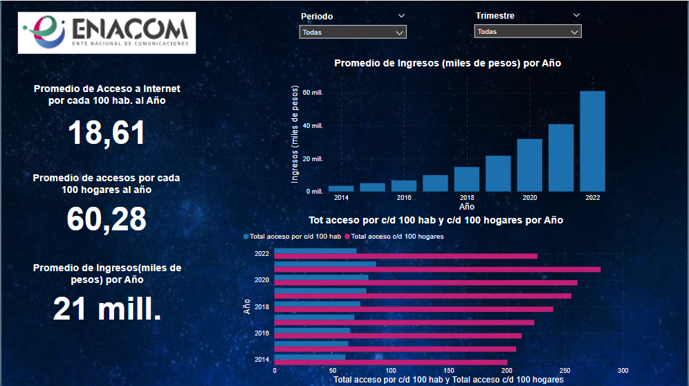
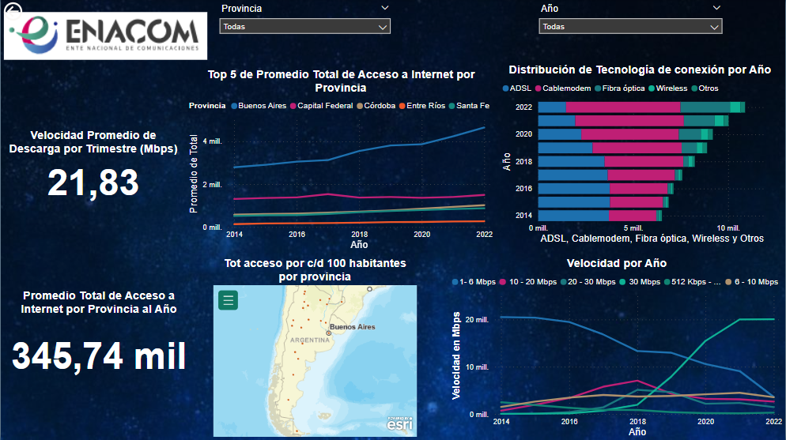

<h1 align='center'>
 <b>Proyecto  Individual III</b>
</h1>

***
<h1 align='center'>
<b>Telecomunicaciones En Argentina ☎🎧📡📺</b>
</h1>

  

***
En este proyecto, se lleva a cabo un análisis de datos de la empresa [Enacom](https://www.enacom.gob.ar/) en Argentina, asumiendo el rol de _Data Analyst_ y realizando el proceso necesario para dicho análisis. Se comienza con un análisis exploratorio de los datos  EDA.

[Enacom](https://www.enacom.gob.ar/) es el organismo responsable de regular el mercado de las comunicaciones en el país, con el objetivo de garantizar que todos los usuarios cuenten con servicios de calidad. Su labor se enfoca en asegurar el acceso de todos los argentinos a servicios como internet, telefonía fija y móvil, radio, servicios postales y televisión.

***

### **✉ Contexto**
***
Las telecomunicaciones se refieren a la transmisión de información a través de medios electrónicos, como la telefonía, la televisión, la radio y el internet. Estos medios de comunicación permiten la transferencia de información entre personas, organizaciones y dispositivos a largas distancias. El internet, en particular, ha transformado radicalmente la forma en que nos comunicamos, trabajamos, aprendemos y nos entretenemos.

La industria de las telecomunicaciones desempeña un papel vital en la sociedad, ya que facilita la difusión de información a nivel internacional y permite la comunicación continua, incluso en medio de una pandemia mundial. En Argentina, esta industria se destaca por su desarrollo en el sector, alcanzando un total de 62,12 millones de conexiones para el año 2020.

<h1 align='center'>
 <b>Desarrollo del Proyecto III</b>
</h1>

### **📄Análisis Exploratorio de Datos EDA**
***

Se realiza un analisis exploratorio de datos, donde se analizaron variables, como:

* Tipo de datos
* Cantidad de datos perdidos o nan.
* Estadísticas descriptivas para las variables cuantitativas y cualitativas.
* Correlación entre las variables.

El análisis exploratorio se documentó en el notebook _EDA.ipynb_, detallando cada uno de los pasos realizados, con el respectivo análisis de los resultados. Se utilizaron distintas librerías, como pandas, matplotmatplotlib, numpy, seaborn,sweetviz, entre otras para generar los gráficos y poder generar una información visual mucho mas util.

### **📉Resultados y Análisis**
***
En la primera página del panel de control, se realiza un análisis de la velocidad promedio anual, medida en Mbps (Megabits por segundo), que indica la velocidad a la que viaja la conexión a internet. Este análisis se presenta como un indicador clave del servicio proporcionado, desglosado por provincia, tecnología y año. Además, se muestra un mapa que representa el acceso a internet por cada 100 habitantes en las provincias donde el servicio está disponible.

Según se observa en el gráfico de barras, el acceso a internet varía según la tecnología utilizada, siendo mayor para el cable módem y seguido por el servicio ADSL. Estas tendencias se mantienen consistentes en todas las provincias analizadas. Por otro lado, el gráfico de líneas muestra que la velocidad propuesta fluctúa con el tiempo, lo cual sugiere posibles problemas en la prestación del servicio, ya que se observa una disminución en la velocidad a lo largo del tiempo. Por lo tanto, se recomendaría a la empresa que realice mejoras en este aspecto.

  

En la segunda página se presentan los indicadores clave de rendimiento (KPI) que muestran las tasas de acceso a Internet por cada 100 habitantes y 100 hogares. Estos KPI varían en función del año, período y trimestre. Además, se muestra la suma de los ingresos anuales.En la gráfica de suma de ingresos (expresados en miles de pesos) por año, se aprecia un aumento constante a lo largo del tiempo. Esto indica que los servicios prestados por la empresa están generando ganancias.

Asimismo, en la gráfica de barras ubicada en la parte inferior derecha, se muestra el acceso a Internet por cada 100 habitantes y cada 100 hogares a lo largo del tiempo. Se observa un incremento general en estas tasas a medida que transcurren los años. Sin embargo, se aprecia una disminución para el año 2022, lo cual sugiere la existencia de alguna situación externa que ha provocado esta baja en la tendencia ascendente que se venía registrando.

  

### **🚀Conclusiones**
***
1. El acceso a Internet varía según la tecnología utilizada, siendo el cable módem el método más comúnmente utilizado, seguido por ADSL.

2. Existe una fluctuación en la velocidad de Internet a lo largo del tiempo, lo que indica posibles fallas en la prestación del servicio.

3. Los ingresos de la empresa han aumentado de manera constante a lo largo del tiempo, lo que sugiere que los servicios prestados están generando ganancias.

### **👀Recomendaciones**
***

1. Realizar mejoras en la calidad y estabilidad del servicio de Internet para garantizar una velocidad más constante y evitar posibles fallas en la conexión.

2. Investigar las razones detrás de la disminución en el acceso a Internet para el año 2022 y tomar medidas correctivas para restablecer la tendencia ascendente.

3. Continuar monitoreando y analizando los indicadores de rendimiento, como las tasas de acceso por cada 100 habitantes y hogares, para identificar tendencias y realizar ajustes estratégicos en la prestación del servicio.

Estas conclusiones y recomendaciones tienen como objetivo mejorar la calidad del servicio de Internet y optimizar los ingresos de la empresa en función de las necesidades y expectativas de los usuarios.

## **📎Links**
* <A HREF="https://datosabiertos.enacom.gob.ar/dashboards/20000/acceso-a-internet/">Datasets principales.</A>.
 
* <A HREF="https://datosabiertos.enacom.gob.ar/home"> Datasets complementarios.</A> 

## **📈Tecnologías**
***
Una lista de tecnologías utilizadas en el proyecto:
* 🐍[Python](https://docs.python.org/3/): Version 3.85
* 🐼[Pandas](https://pandas.pydata.org/): Version 3.3.0
* 💻[Numpy](https://numpy.org/doc/): Version 3.2.0
* 📊 [Power Bi](https://powerbi.microsoft.com/es-es/)

## **Autor 🧜‍♀️**
***

* Andrea Huertas 
* Correo electronico: andrehuertasg@gmail.com 
* Linkedin: https://www.linkedin.com/in/luz-andrea-huertas-guerrero-30bb7a237/
